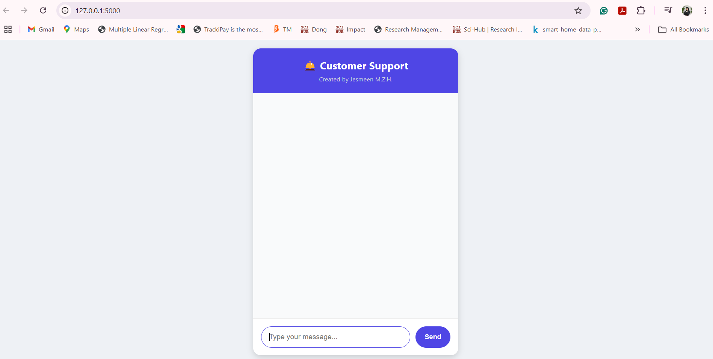
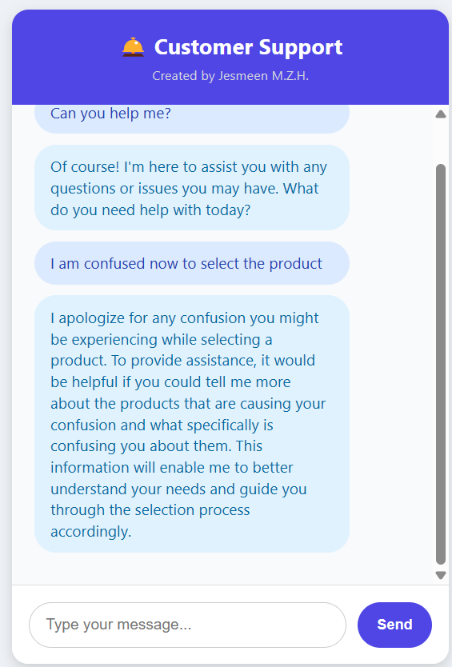

Perfect! Let's add your steps properly into the `README.md` with a nice clean format.  
I'll also make sure to **fix typos**, **make the steps clear**, and **list all required libraries** based on your Flask app.

Here’s your updated **README.md** 👇:

---

# 🛠 Local LLM Customer Service Chatbot

A lightweight Flask web application that turns a local LLM (DeepSeek-LLM via Ollama) into a professional customer service assistant.

---

## 🚀 Features
- Chat with a locally running large language model (DeepSeek-LLM).
- Friendly, polite, and professional customer support behavior.
- System prompt ensures consistent, helpful responses.
- Easy to extend or customize.
- No cloud or external APIs required — runs fully offline!

---

## 🏗️ Tech Stack
- Python 3 (Flask)
- Ollama (local LLM server)
- DeepSeek-LLM model
- HTML + JavaScript frontend

---

## 📋 How to Run DeepSeek R1 Locally for a Chatbot

### 🛠 Step 1: Install Ollama
Ollama is the easiest way to run models like DeepSeek locally.

- Visit [ollama.com](https://ollama.com/) and download/install it for your operating system (Windows, Mac, or Linux).
- After installing, open a terminal and run:

```bash
ollama run deepseek 
or
ollama run deepseek-llm:latest
```

This command will automatically download and start DeepSeek-LLM.

---

### 🛠 Step 2: Set up Python Environment

Clone this repository and set up a virtual environment:

```bash
git clone https://github.com/jesmeen-online/llm-customer-support-chatbot.git
cd llm-customer-service-chatbot

# Create and activate virtual environment
python -m venv .venv
source .venv/bin/activate  # or .venv\Scripts\activate on Windows
```

---

### 🛠 Step 3: Install Required Python Libraries

Install all necessary libraries for the Flask application:

```bash
pip install flask requests
```

**Required Libraries:**
- Flask — for the web server and API routes
- Requests — for sending HTTP requests to Ollama server

You can also use a `requirements.txt`:

```txt
flask
requests
```

---

### 🛠 Step 4: Run the Flask Chatbot

Start the chatbot server:

```bash
python chatbot.py
```

Then open your browser and go to:

```
http://127.0.0.1:5000
```

✅ Now you can chat with DeepSeek-LLM locally through a web UI!

---

## 🧠 How it Works
- User sends a message from the browser.
- Flask backend forwards the message to Ollama's `/api/chat` endpoint.
- DeepSeek-LLM processes the input and generates a streamed response.
- The chatbot UI displays the response to the user.

---

## 🖼️ Screenshot

> 
> 

---

## ✨ Future Improvements
- Live "typing..." animation while bot responds
- Save and export chat history
- Knowledge Base (FAQ) integration
- User authentication (optional)

---

## 📄 License

This project is open-source and available under the [MIT License](LICENSE).

---

## 💬 Acknowledgements
- [Ollama](https://ollama.com/) — Local LLM server.
- [DeepSeek LLM](https://github.com/deepseek-ai/DeepSeek-LLM) — Open-source large language model.

---

# ✅ Quick Checklist

| Task | Status |
|:---|:---|
| Ollama installed | ✅ |
| DeepSeek-LLM running | ✅ |
| Flask server running | ✅ |
| Chatbot UI working | ✅ |

